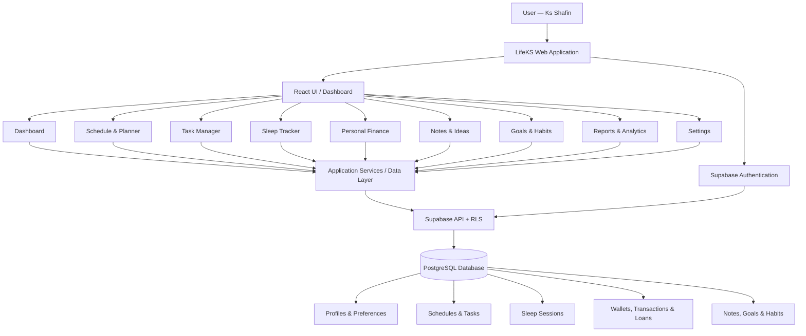
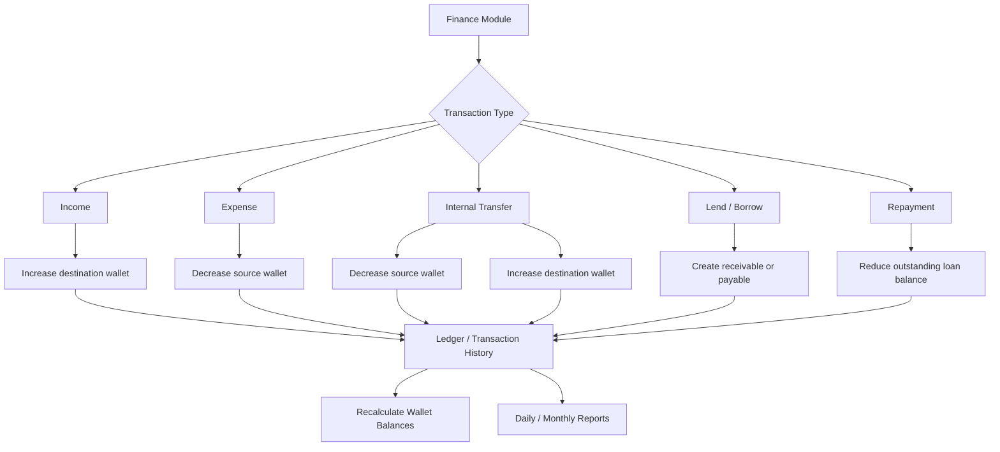
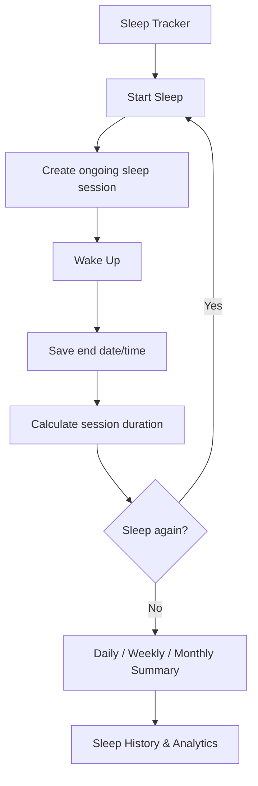
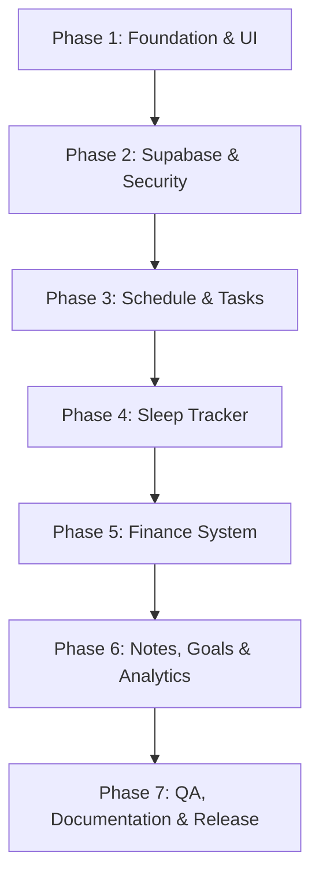

# LifeKS — Architecture Diagrams

These Mermaid diagrams can be previewed by GitHub in Markdown.

## 1. System Architecture

```mermaid
flowchart TD
    U["User — Ks Shafin"] --> APP["LifeKS Web Application"]
    APP --> AUTH["Supabase Authentication"]
    APP --> UI["React UI / Dashboard"]
    UI --> D["Dashboard"]
    UI --> S["Schedule & Planner"]
    UI --> T["Task Manager"]
    UI --> SL["Sleep Tracker"]
    UI --> F["Personal Finance"]
    UI --> N["Notes & Ideas"]
    UI --> G["Goals & Habits"]
    UI --> R["Reports & Analytics"]
    UI --> ST["Settings"]
    D --> API["Application Services / Data Layer"]
    S --> API
    T --> API
    SL --> API
    F --> API
    N --> API
    G --> API
    R --> API
    ST --> API
    API --> SB["Supabase API + RLS"]
    AUTH --> SB
    SB --> DB[("PostgreSQL Database")]
    DB --> P["Profiles & Preferences"]
    DB --> SCH["Schedules & Tasks"]
    DB --> SLP["Sleep Sessions"]
    DB --> FIN["Wallets, Transactions & Loans"]
    DB --> W["Notes, Goals & Habits"]
```

## 2. Finance Flow

```mermaid
flowchart TD
    A["Finance Module"] --> B{"Transaction Type"}
    B --> C["Income"]
    B --> D["Expense"]
    B --> E["Internal Transfer"]
    B --> F["Lend / Borrow"]
    B --> G["Repayment"]
    C --> C1["Increase destination wallet"]
    D --> D1["Decrease source wallet"]
    E --> E1["Decrease source wallet"]
    E --> E2["Increase destination wallet"]
    F --> F1["Create receivable or payable"]
    G --> G1["Reduce outstanding loan balance"]
    C1 --> H["Ledger / Transaction History"]
    D1 --> H
    E1 --> H
    E2 --> H
    F1 --> H
    G1 --> H
    H --> I["Recalculate Wallet Balances"]
    H --> J["Daily / Monthly Reports"]
```

## 3. Sleep Flow

```mermaid
flowchart TD
    A["Sleep Tracker"] --> B["Start Sleep"]
    B --> C["Create ongoing sleep session"]
    C --> D["Wake Up"]
    D --> E["Save end date/time"]
    E --> F["Calculate session duration"]
    F --> G{"Sleep again?"}
    G -->|Yes| B
    G -->|No| H["Daily / Weekly / Monthly Summary"]
    H --> I["Sleep History & Analytics"]
```

## 4. Development Roadmap

```mermaid
flowchart TD
    A["Phase 1: Foundation & UI"] --> B["Phase 2: Supabase & Security"]
    B --> C["Phase 3: Schedule & Tasks"]
    C --> D["Phase 4: Sleep Tracker"]
    D --> E["Phase 5: Finance System"]
    E --> F["Phase 6: Notes, Goals & Analytics"]
    F --> G["Phase 7: QA, Documentation & Release"]
```
